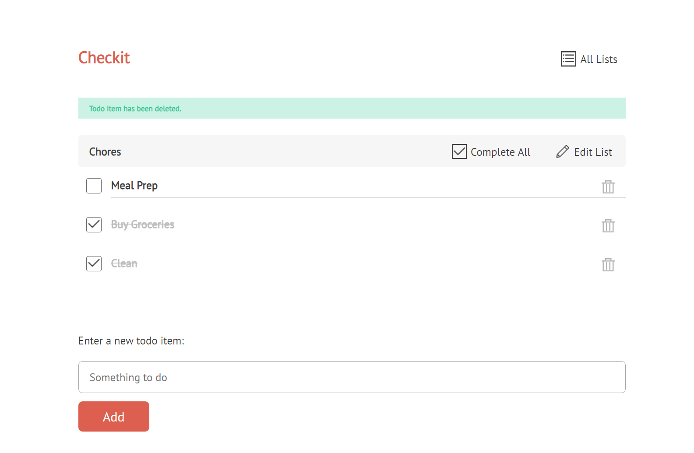

# CheckIt

## About
CheckIt is an efficient Todo web application built using Ruby, Sinatra, Erb, PostgreSQL, HTML, and CSS.

This app was designed to help users manage their tasks and stay organized. With user-friendly interfaces and intuitive features, CheckIt streamlines the process of creating, editing, and completing tasks.

## Prerequisites
* Ruby (>=3.0.0)
* PostgreSQL (>=12)
* Bundler

## Installation

* Clone the repository: `git clone git@github.com:eemanioui/checkit.git`
* Navigate to the project directory: `cd checkit`
* Install dependencies: `bundle install`
* start db server: `sudo service postgresql start`
* Start the application: `ruby task_manager.rb`

## Future Improvements

* **User Profiles**: Allow users to customize their profiles with avatars and personal information.
* **Task Reminders**: Set up reminders for tasks to receive notifications or emails about upcoming deadlines.
* **Collaboration**: Enable users to share tasks and collaborate on projects with colleagues or friends.
* **Tags and Categories**: Implement tagging or categorization options to help users organize tasks more effectively.

## Technologies Used
* **Ruby**: Programming language used for the backend
* **Sinatra**: Ruby web framework
* **Erb**: Embeded Ruby Templates
* **PostgreSQL**: Database management system
* **HTML/CSS**: Used for frontend styling and structure
